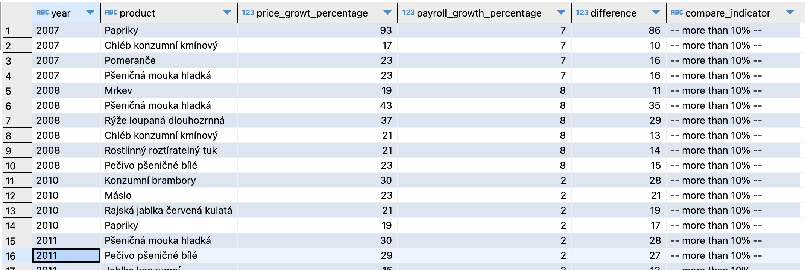

# Engeto SQL Research

## Introduction to the Project

In your analytical department of an independent company that deals with the standard of living of citizens, you have agreed to try to answer a few defined research questions that address the availability of basic food to the general public. Colleagues have already defined the basic questions to which they will try to answer and provide this information to the press department. This department will present the results at the following conference focused on this area.

They need you to prepare robust data bases in which it will be possible to see a comparison of food availability based on average incomes for a certain period of time.

As additional material, prepare a table with GDP, GINI coefficient, and the population of other European countries in the same period, as a primary overview for the Czech Republic.

### RESEARCH QUESTIONS:

1. Are wages increasing over the years in all sectors, or are they decreasing in some?
2. How many liters of milk and kilograms of bread can be bought for the first and last comparable period in the available data of prices and wages?
3. Which food category is getting more expensive the slowest (i.e., it has the lowest annual percentage increase)?
4. Is there a year in which the annual increase in food prices was significantly higher than wage growth (more than 10%)?
5. Does the level of GDP affect changes in wages and food prices? In other words, if GDP increases significantly in one year, will this be reflected in food prices or wages in the same or following year with a more significant increase?

### Data Preparation

First, we will create a dataset by combining the available data from the Engeto database. This will ensure proper functionality. Before running the scripts to answer the research questions, please run these scripts first:

```
primary_dataset.sql
secondary_dataset.sql
```

### ANSWER Q1:

To obtain the answer, we always compared the values with the previous year. In the case of a decrease, a condition about reduced salary was taken into account, according to which only those records were obtained where and in which year the decrease actually occurred. During the set timeframe, the wages were increasing in all of the monitored area except for:


### ANSWER Q2:

First, I determined the threshold values for comparable periods. This was followed by the calculation of average wages and prices. The result is the ratio between these values. Hence, the purchasing power is expressed by the number of possible purchases of the given assortment.


### ANSWER Q3:

Based on the newly created view named 'v_food_dif_per_year', we can see the course of price changes during the monitored period of time (during years 2006 to 2018). By adding up the average prices differences for the entire period, we were able to determine the average percentage of increase/decreace:

- Product 'Rajská jablka červená kulatá' is the only one product with average price difference decreasing in the monitored period of time. Between years 2006 - 2018 is the average price decrease of this product 1%.

### ANSWER Q4:

This code creates a table named t_anual_increse_prices and fills it with data. The data are calculated based on the average price and average payroll for each product and year from another table, t_martin_kalkus_project_SQL_primary_final. The code calculates how much the prices and wages have increased compared to the previous year and also finds the difference between these two percentage increases. It also includes a column called compare_indicator, which shows whether this difference is greater than or equal to 10%. The resulting data are sorted from the largest difference down, and then by compare_indicator and year.


### ANSWER Q5:

This code sets up a kind of data display, named v_GDP_price_payroll. It's designed to show different figures about the economy, like how the GDP, prices, and salaries are changing in the Czech Republic. The code uses a few steps and connections to gather and crunch the numbers. What you get is a comparison of data from the past year, the present, and the next year. It shows things like how much prices and salaries are generally going up, and if the GDP is veering off its usual path. Then, it looks at how GDP growth is linked to both price and salary increases. Each of these connections gets its own easy-to-understand description. All this info is sorted by year and the GDP amounts.

Based on the output, it is not possible to determine any correlation between the increase in GDP and the rising prices and wages.
